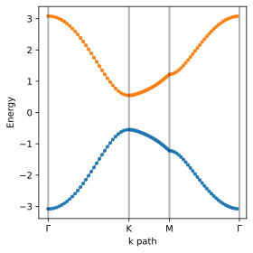

# TightBinding_PY

A Python port of **TightBinding.jl** for constructing tight-binding models on
Bravais lattices, plotting band structures, and computing Chern numbers.
The package connects real-space hopping models to periodic-gauge Bloch
Hamiltonians and finite samples with twisted boundary conditions.

- **Lattices:** custom Bravais vectors and sublattices, with `square`,
  `honeycomb`, `kagome`, `Lieb`, and `dice` presets.
- **Hoppings:** translation-invariant templates or nearest-neighbour graph
  distances, with automatic Hermitian conjugates.
- **Hamiltonians:** momentum-space matrices and sparse real-space matrices
  with periodic, open, or twisted boundaries.
- **Topology:** single-band and non-interacting many-body Chern numbers using
  the Fukui–Hatsugai–Suzuki method.
- **Plots:** lattices, hopping graphs, band paths, and two-dimensional band
  contours with first-Brillouin-zone outlines.



## Installation

Requires **Python 3.12 or newer**. Runtime dependencies are NumPy, SciPy,
matplotlib, and igraph; their minimum versions are in
[`pyproject.toml`](pyproject.toml).

Clone the repository and install the package with `uv`:

```bash
git clone https://github.com/GrothendieckUniverse/TightBinding_PY.git
cd TightBinding_PY
uv sync --locked
```

Alternatively, install into an active Python environment with
`python -m pip install -e .`. The distribution name is `tightbinding-py`,
while the Python import name is `tightbinding_py`.

## Quick start: a square-lattice model

Run this with the installed package, for example using `uv run python`:

```python
import numpy as np
from tightbinding_py import (
    add_hopping_term,
    build_Hk_crys,
    build_real_space_tb_Hamiltonain,
    initialize_real_space_lattice,
    initialize_real_space_tightbinding_model,
    initialize_uniform_grids_from_lattice,
    plot_bands,
)

lat = initialize_real_space_lattice(
    lattice_name="square",
    sample_size=[4, 4],
    pbc_indicator=[True, True],
)
tb = initialize_real_space_tightbinding_model(lat, model_name="Square NN")

# One orbital per cell; the reverse hoppings are added automatically.
for cell_to in ((1, 0), (0, 1)):
    add_hopping_term(tb, ((((0, 0), 1), (cell_to, 1)), -1.0))

Hk = build_Hk_crys(tb)
print(np.linalg.eigvalsh(Hk([0.0, 0.0])))  # [-4.]

H = build_real_space_tb_Hamiltonain(tb)
print(H.shape)  # (16, 16), a scipy.sparse.csc_matrix

k_grid = initialize_uniform_grids_from_lattice(lat)
fig, ax = plot_bands(
    Hk,
    k_grid,
    k_path=[[0, 0], [0.5, 0], [0.5, 0.5], [0, 0]],
    k_path_name_list=["Γ", "X", "M", "Γ"],
    nband_range=range(1, lat.n_sub + 1),
    save_path="square_bands.svg",
)
```

`build_real_space_tb_Hamiltonain` is the current exported spelling of the
real-space Hamiltonian builder. Plotting functions return `(fig, ax)` for
further customization; use `matplotlib.pyplot.show()` to display a figure
in a script.

## Haldane model and Chern numbers

The [Haldane example](examples/haldane_honeycomb.py) supplies a complete model
builder with nearest-neighbour hopping, a staggered sublattice potential,
and complex next-nearest-neighbour hopping. From the repository root:

```python
from examples.haldane_honeycomb import build_haldane_model
from tightbinding_py import (
    build_Hk_crys,
    Chern_number_Fukui_Hatsugai_Suzuki,
    many_body_Chern_number_Fukui_Hatsugai_Suzuki,
)

tb = build_haldane_model()  # t1=-1, t2=-0.24, phi=π/2, mass=0.7
Hk = build_Hk_crys(tb)

for band in (1, 2):
    c = Chern_number_Fukui_Hatsugai_Suzuki(Hk, band=band, nk=51)
    print(f"Band {band}: {c:.6f}")  # -1.000000, +1.000000

c_half = many_body_Chern_number_Fukui_Hatsugai_Suzuki(
    tb, n_occ=tb.lattice.n_cell, nθ=21,
)
print(f"Half filling: {c_half:.6f}")  # -1.000000
```

The many-body routine evaluates Slater-determinant overlaps for a
**non-interacting** system on a two-dimensional torus. `n_occ` counts occupied
single-particle states, so one filled band has `n_occ = n_cell`. For a gapped
occupied subspace its Chern number equals the sum over occupied bands; full
filling of this two-band model gives zero. The routine diagonalizes dense
finite-sample Hamiltonians at every flux point, so start with small samples.

The graph-based `haldane_nnn_hopping_amplitude` helper uses the opposite
chirality convention to this example's explicit templates: with the same
parameters it reverses the band Chern-number signs. See the
[design notebook](doc/design.ipynb) for the conventions and construction details.

## Coordinates, indices, and boundary conditions

- Bravais vectors are supplied as rows of `brav_vec_list`. Sublattice
  positions and `Hk` inputs use crystal coordinates, with
  `r_cart = r_crys @ np.asarray(brav_vec_list)` and reciprocal vectors
  satisfying `b_i · a_j = 2π δ_ij`.
- Cell coordinates start at zero; the first Bravais axis advances fastest.
  Public site, sublattice, graph, and band indices are **1-based**.
  Python lists and NumPy arrays still use ordinary zero-based indexing.
- A hopping is `(((cell_from, sub_from), (cell_to, sub_to)), amplitude)`.
  Cell coordinates are integer tuples. `add_hopping_term` expands a template
  across the sample and adds its conjugate by default; use
  `is_hermitian=False` for the on-site terms shown in the Haldane example.
- `input_hopping_map` stores templates; `full_hopping_map` stores finite-sample
  hoppings. Graph-distance additions modify only the latter. Adding a
  template rebuilds the expanded map, and `build_Hk_crys` prefers templates
  whenever they exist, so use one construction approach consistently.
- `build_Hk_crys` uses a periodic gauge: integer reciprocal-coordinate shifts
  leave `Hk` unchanged. The lattice layer supports two and three dimensions;
  the Chern-number routines and lattice/contour plots are two-dimensional.

Twists are specified in units of `2π` using `twisted_phases_over_2π`. A hopping
with winding `w_d` acquires `exp(i * 2π * sum(θ_d * w_d))`. The corresponding
momentum-grid shift is `θ_d / sample_size[d]`. A nonzero twist is allowed only
in a periodic direction.

| Geometry | `pbc_indicator` | Allowed twists |
|---|---|---|
| Torus | `[True, True]` | `[θ_x, θ_y]` |
| Cylinder | `[True, False]` | `[θ_x, 0.0]` |
| Open sample | `[False, False]` | `[0.0, 0.0]` |

Set twists when constructing the lattice, or pass
`twisted_phases_over_2π=[θ_x, θ_y]` to
`build_real_space_tb_Hamiltonain` or `generate_bilinear_terms` to override them
for a calculation.

## Notebooks

The notebooks combine explanations, equations, and worked calculations:

| Notebook | Topics |
|---|---|
| [Lattices](doc/lattice.ipynb) | Coordinates, presets, nearest-neighbour graphs, boundaries |
| [Tight-binding models](doc/tightbinding_model.ipynb) | Hopping maps, Bloch Hamiltonians, bands, finite Hamiltonians |
| [Band topology](doc/band_topology.ipynb) | Berry curvature, FHS method, Haldane phase diagram |
| [Many-body Chern number](doc/many_body_chern.ipynb) | Flux torus, Slater determinants, filling |
| [Package design](doc/design.ipynb) | Data structures, numerical conventions, Julia port differences |

To open them with JupyterLab and the project environment:

```bash
uv run --with jupyterlab --with ipykernel jupyter lab doc/
```

Jupyter is optional and is not a runtime dependency of the package.

## Examples

Run example scripts from the repository root. They save SVG figures under
[`figures/examples/`](figures/examples/).

```bash
uv run python examples/haldane_honeycomb.py
uv run python examples/kagome_flat_band.py
uv run python examples/lieb_flat_band.py
uv run python examples/dice_fluxed_anisotropic.py
uv run python examples/ideal_checkerboard_extended_hopping.py
uv run python examples/nonideal_checkerboard_extended_hopping.py
```

## Package layout and Julia compatibility

| Module | Responsibility |
|---|---|
| [`lattice.py`](src/tightbinding_py/lattice.py) | `Real_Space_Lattice`, igraph-backed `LatticeGraph`, lattice plots |
| [`tb_model.py`](src/tightbinding_py/tb_model.py) | Hopping templates, graph-distance hoppings, Haldane helper |
| [`uniform_grids.py`](src/tightbinding_py/uniform_grids.py) | Uniform reciprocal and flux grids |
| [`utils.py`](src/tightbinding_py/utils.py) | Dual bases, Hamiltonians, bilinear terms, Chern numbers |
| [`band_plot.py`](src/tightbinding_py/band_plot.py) | Band paths, contours, first-Brillouin-zone vertices |

Public functions and classes are re-exported by `tightbinding_py`. The port
retains Julia's 1-based public indices and first-axis-fastest enumeration.
It uses NumPy numerical arrays, SciPy sparse matrices, matplotlib, and igraph;
symbolic lattices are not supported. Mutating function names omit Julia's `!`
suffix, and the lattice-based grid constructor is named
`initialize_uniform_grids_from_lattice`. The plot function is exported as
`plot_band_contour`. Detailed differences are in the design notebook.

## Tests

```bash
uv run python -m unittest discover -s test -v
```

The suite checks lattice geometry and indexing, reciprocal grids, hopping
Hermiticity and overwriting, sparse Hamiltonians, twisted-boundary phases,
Haldane eigenvalues and band Chern numbers, and the many-body Chern number at
half filling. Set `MPLBACKEND=Agg` when running plotting scripts without a display.

## References

- F. D. M. Haldane, *Phys. Rev. Lett.* **61**, 2015 (1988).
- K. Sun, Z. Gu, H. Katsura, and S. Das Sarma, *Phys. Rev. Lett.* **106**, 236803 (2011).
- T. Fukui, Y. Hatsugai, and H. Suzuki, *J. Phys. Soc. Jpn.* **74**, 1674 (2005).
- R. Resta, *Rev. Mod. Phys.* **66**, 899 (1994).

## License

[Apache License 2.0](LICENSE).
